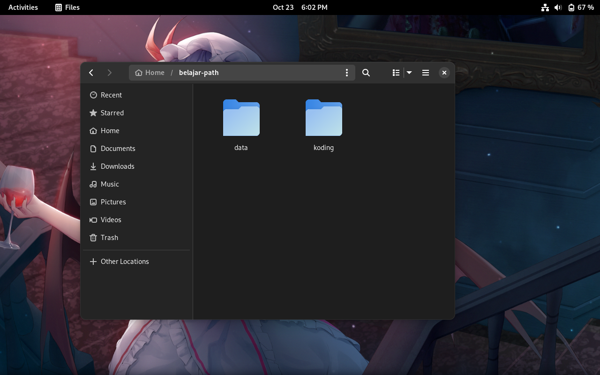
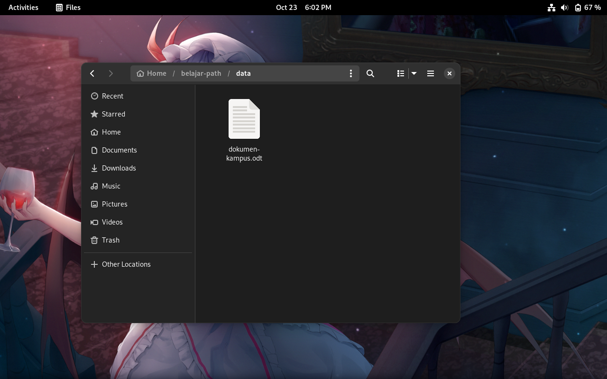
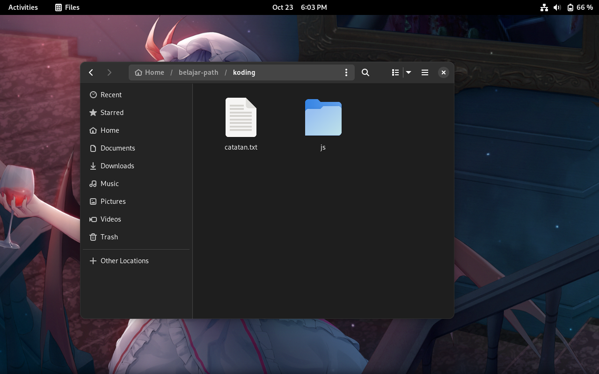
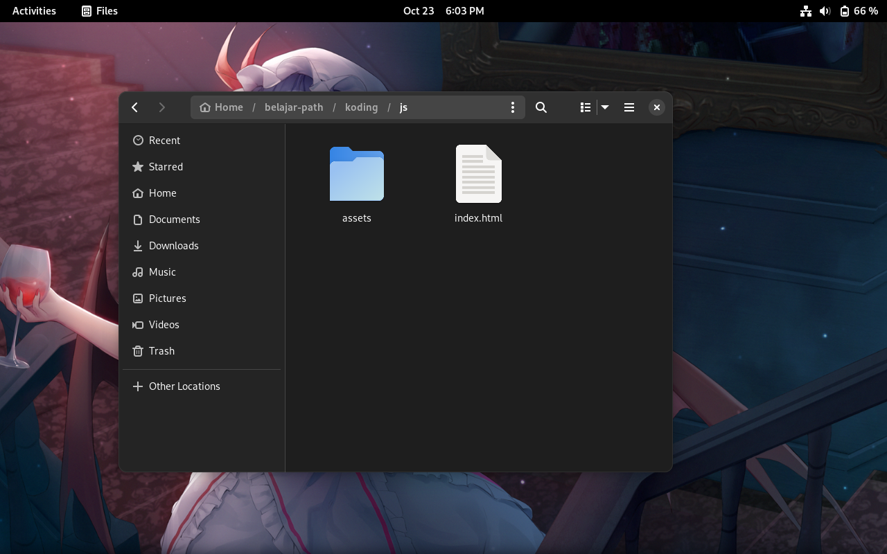
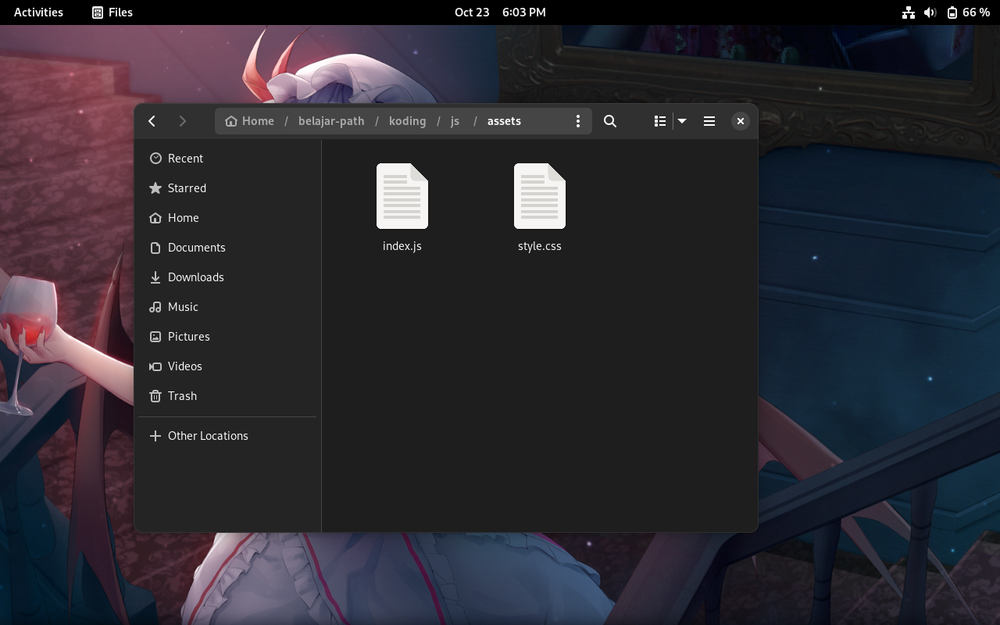

# Unix Path

Sebelumnya kalau belum membaca [`README.md`](https://github.com/Cyber-STMIK-Amikom-Surakarta/materi-path/blob/main/README.md) tolong dibaca terlebih dahulu karena itu merupakan pembukaan.

## Contoh

Jadi sebelum kita memulai ini ada beberapa screenshot struktur folder dan file di Files

Posisi kita di `~` di folder `belajar-path`, simbol `~` ini menunjukan folder `home` akun kita, jadi jika ada `~` bermaksud `/home/username-mu` secara tidak langsung simbol `~` ini merupakan relative path.

hmm, mari kita liat folder data

ada file `document-kampus.odt`, mari kita kembali dan masuk di folder koding.

ada file `catatan.txt` dan folder `js`, mari kita liat apa isinya

ada file `index.html` dan folder `assets`

### Absolute Path

Okay, setelah melihat screenshot tadi, kita bisa menuliskan hirarki agar enak dilihat

- `~/belajar-path` => `/home/username-mu/belajar-path`

    - data `/home/username-mu/belajar-path/data`

        - dokumen-kampus.odt `/home/username-mu/belajar-path/data/dokumen-kampus.odt`

    - koding `/home/username-mu/belajar-path/koding`

        - catatan.txt `/home/username-mu/belajar-path/koding/catatan.txt`

        - js `/home/username-mu/belajar-path/koding/js`

            - index.html `/home/username-mu/belajar-path/koding/js/index.html`

            - assets `/home/username-mu/belajar-path/koding/js/assets`

                - index.js `/home/username-mu/belajar-path/koding/js/assets/index.js`

                - style.css `/home/username-mu/belajar-path/koding/js/assets/style.css`

Okay sangat menarik, apakah bentuk seperti ini membuat kepala anda sakit, kalau iya berarti kita sama, berikut yang berbentuk list

- `/home/username-mu/belajar-path`
- `/home/username-mu/belajar-path/data`
- `/home/username-mu/belajar-path/data/dokumen-kampus.odt`
- `/home/username-mu/belajar-path/koding`
- `/home/username-mu/belajar-path/koding/catatan.txt`
- `/home/username-mu/belajar-path/koding/js`
- `/home/username-mu/belajar-path/koding/js/index.html`
- `/home/username-mu/belajar-path/koding/js/assets`
- `/home/username-mu/belajar-path/koding/js/assets/index.js`
- `/home/username-mu/belajar-path/koding/js/assets/style.css`

