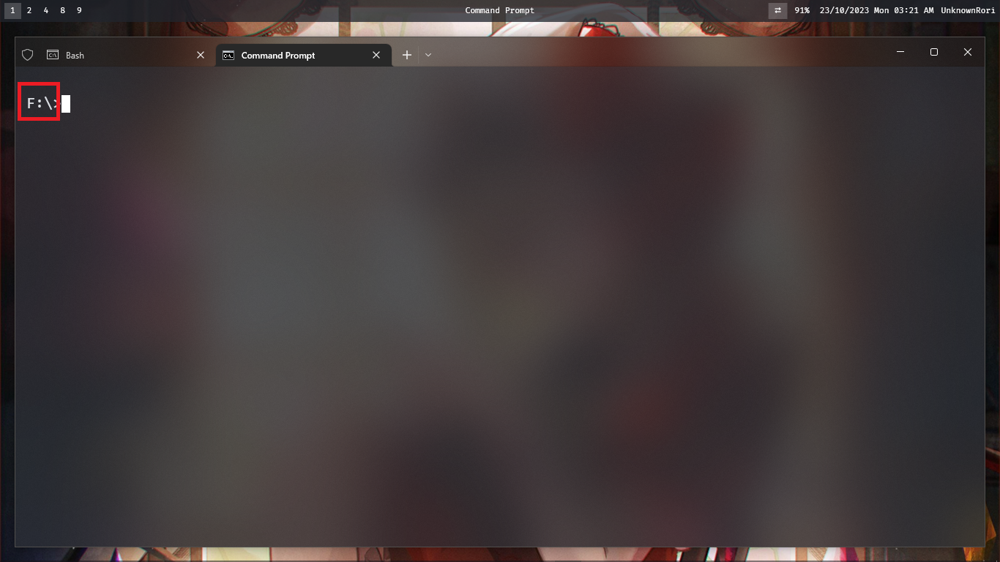
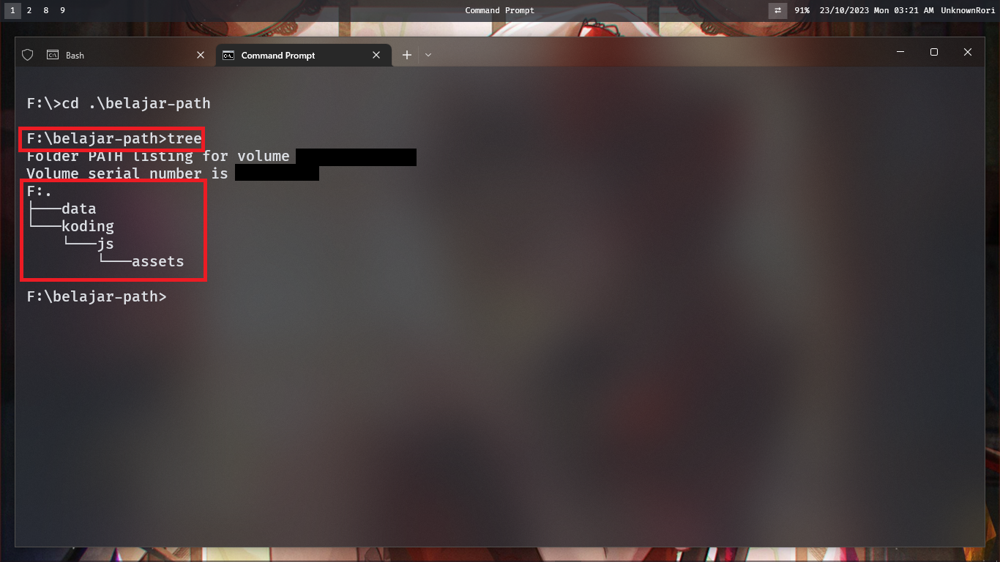
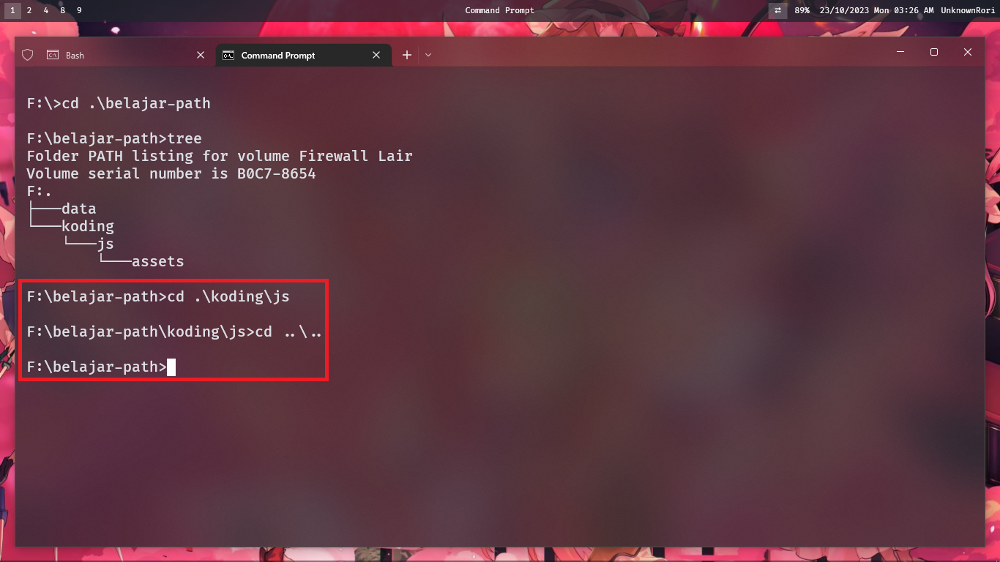

# Windows Path

Sebelumnya kalau belum membaca [`README.md`](https://github.com/Cyber-STMIK-Amikom-Surakarta/materi-path/blob/main/README.md) tolong dibaca terlebih dahulu karena itu merupakan pembukaan.

## Contoh

Jadi sebelum kita memulai ini ada beberapa screenshot struktur folder dan file di File Explorer

Posisi kita di drive `F:\` di folder `belajar-path` jadi jika diketikan menjadi path akan menjadi `F:\belajar-path`.

Selalu perhatikan path yang ditunjukan oleh `File Explorer`

Mari kita lihat folder data

okay, mari kita liat folder koding yang tadi

huuu, ada folder lagi, mari kita cek

hohoho, ada lagi

### Absolute Path

Okay, setelah melihat semua screenshot itu, kita bisa menuliskan hirarki agar enak dilihat

- `F:\`

    - belajar-path (`F:\belajar-path`)

        - data (`F:\belajar-path\data`)
        
            - tugas-kampus.odt (`F:\belajar-path\data\tugas-kampus.odt`)

        - koding (`F:\belajar-path\koding`)

            - catatan.txt (`F:\belajar-path\koding\catatan.txt`)

            - js (`F:\belajar-path\koding\js`)

                - index.html (`F:\belajar-path\koding\js\index.html`)

                - assets (`F:\belajar-path\koding\js\assets`)

                    - index.js (`F:\belajar-path\koding\js\assets\index.js`)
                    - style.css (`F:\belajar-path\koding\js\assets\style.css`)

Okay sangat menarik, apakah bentuk seperti ini membuat kepala anda sakit, kalau iya berarti kita sama, berikut yang berbentuk list

- `F:\`
- `F:\belajar-path`
- `F:\belajar-path\data`
- `F:\belajar-path\data\tugas-kampus.odt`
- `F:\belajar-path\koding`
- `F:\belajar-path\koding\catatan.txt`
- `F:\belajar-path\koding\js`
- `F:\belajar-path\koding\js\index.html`
- `F:\belajar-path\koding\js\assets`
- `F:\belajar-path\koding\js\assets\index.js`
- `F:\belajar-path\koding\js\assets\style.css`

### Relative Path

Tekan `Windows+R` untuk mengeluarkan `runner` lalu ketik `cmd`, nah karena contoh ini menggunakan drive `F:\` hal pertama kita ketik ialah `F:\`

ditempatku seperti ini, liat yang dikotak itu merupakan `Absolute Path` yang sekarang dipakai oleh terminal, mari kita `cd` (cd digunakan untuk pindah folder) ke `belajar-path` kita bisa menggunakan `.\belajar-path` atau `belajar-path` ataupun `F:\belajar-path`

Kalau kita ketik `tree` itu akan muncul hirarki yang kita buat di sebelumnya

Okay sebenernya udah tamat, tapi mari kita masuk ke js lalu keluar lagi, hal tersebut bisa kita lakukan dengan `cd .\koding\js`

## Note : 

Selamat jika anda sudah sampai disini, anda kurang lebih sudah paham konsep path di windows👏👏

Sekian, kalau ada permasalahan atau pertanyaan bisa buka [issue](https://github.com/Cyber-STMIK-Amikom-Surakarta/materi-path/issues)
